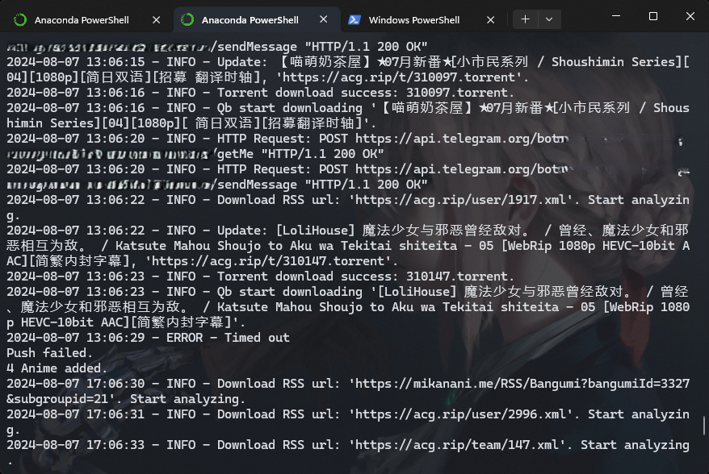
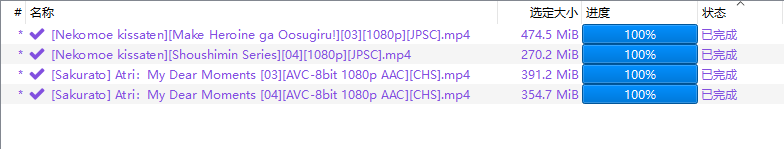
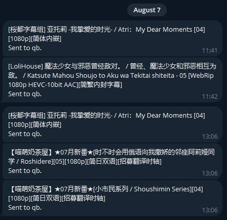

> qb 里开了代理还是不能解析 mikan 和 acg.rip 等 rss 订阅源，顺便学习下 qbittorrent-api 照着 qb 的 rss 订阅写了一个简单的自动追番脚本，消息推送给自己的 tg bot  


## Usage
- 打开 qb;  
- 保证网络连接能打开 rss 订阅;  
- 终端:
  ```shell
  python .\get_torrent.py
  ```


## 准备
- 下载安装 qbittorrent ([qBittorrent Enhanced Edition](https://github.com/c0re100/qBittorrent-Enhanced-Edition))；  
- 下载 WebUI ([VueTorrent](https://github.com/VueTorrent/VueTorrent) 蛮好看的), 记下保存路径;  
  1. Clone branch using git:  
      ```shell
      git clone --single-branch --branch latest-release https://github.com/VueTorrent/VueTorrent.git
      ```
  2. Pull changes every once in a while, using `git pull`.  
- 配置 Web UI：
    - 打开 qb - 设置 - Web UI，启用 'Web 用户界面（远程控制）'；
    - 验证：输入用户名，密码，可选 '对本地主机上的客户端跳过身份验证';
    - 启用 '选择备用的 Web UI', 文件位置选择 VueTorrent 的保存路径;
    - 应用, 确定；
    - 打开浏览器，网址输入 `127.0.0.1:8080` 或 `localhost:8080`，输入用户名密码，进入看见 qb 界面.  
- 配置环境: 
  ```shell
  pip install -r requirements.txt
  ```


## 参数配置 config.json
### Misc
| Parameter  | Description |  Example  |
| ---  | --- |  --- |
| TELEGRAM_BOT_TOKEN  | tg bot token  | 7252******:AAFx7Qiu***************************  |
| USER_ID | tg id | 166*******  |
| rss_urls  | 所有 rss 订阅源 | ["https://acg.rip/user/2996.xml", "https://acg.rip/team/147.xml", "https://acg.rip/user/1917.xml"]  |
| torrent_path  | 种子保存路径  | E:\\\qb\\\torrents  |
| username  | qb 账号 | admin |
| password  | qb 密码 | 123456  |

### 追番设置
| Parameter  | Description |  Example  |
| ---  | --- |  --- |
| name | 规则名称 | 桜都 - 狼与香辛料  |
| rss_url | rss 订阅源 | https://acg.rip/user/2996.xml |
| must_contain | 必须包含关键字，空格隔开 | Wolf 1080p 简  |
| must_not_contain | 必须不含关键字，\| 隔开 | 繁\|12\|11\|09\|07\|06\|05\|04\|03\|02\|01  |
| save_path | 下载保存路径 | F:\\\Anime\\\04\\\狼与香辛料  |
| tags  | 标签  | Anime |
| content_layout | 内容布局 | Subfolder: 创建子文件夹<br> NoSubFolder: 不创建子文件夹  |

详细规则设置参考 [qb-api Docs](https://qbittorrent-api.readthedocs.io/en/latest/apidoc/torrents.html); 添加其他规则, 主程序中 `get_anime_config()`, `qb_download()` 对应修改.


## 补充
- 电脑一直开着，qb 开着，网络能用，在终端运行一次命令理论上就一直能用  ；
- 4小时检查一次更新，主程序 312 行改间隔时间；  
- 日志保存当前路径，并实时在终端显示；
- qb 下载番剧后会把消息推送给 tg bot，推送内容改 `try_send_message()` 里的 `message`；
- Ctrl C 结束；
  

终端 日志  
  

qb 下载  
  

tg bot 推送  
  